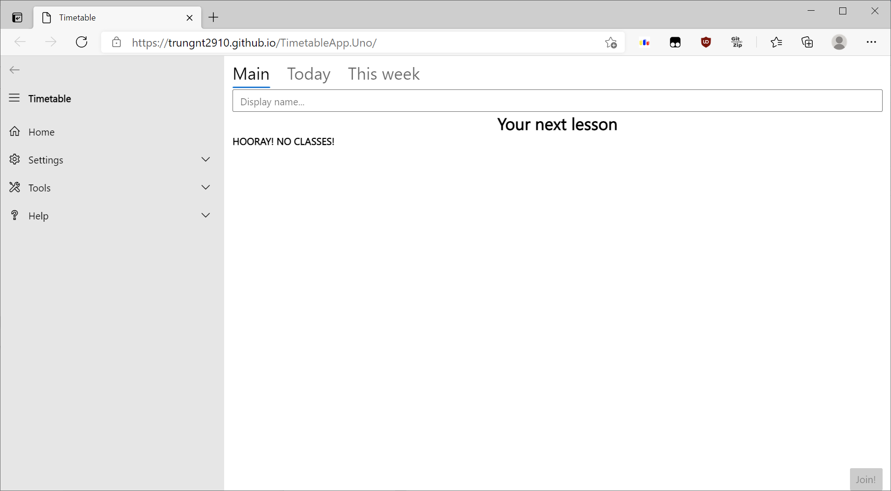
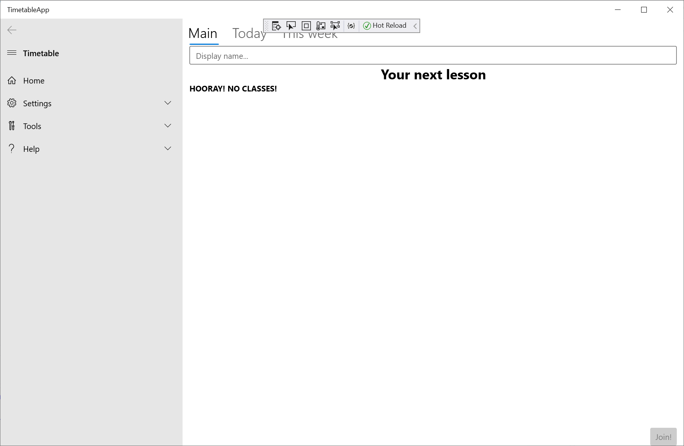
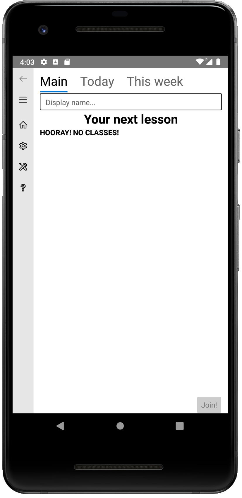

# TimetableApp
Timetable management and automatic online class joining. Created for the Uno Platform, which works on all your devices.

## Try it online:


## Screenshots:
  


## Data format: 
The application downloads the timetable from a URL, provided by the organization. The URL must lead to a JSON file, with this format:

```
{  
   "MD5":"MD5 of real timetable file, for validation.",  
   "Location":"https://example.com/url-to-real-timetable-file"  
}
```

The real timetable file MUST be in this format:

```
{
   "Name":"Name of timetable",  
   "UpdateURL":"Where to check for the next version",  
   "Lessons":[  
        [],  
        [  
               {
                   "StartTime": "07:30:00",  
                   "EndTime": "08:10:00",  
                   "Credentials": {  
                       "$type": "TimetableApp.Core.Zoom.ZoomCredentials, $ASSEMBLY_NAME",  
                       "ID": "room-id",  
                       "Password": "password"  
                       },  
                   "Subject": "subject name",  
                   "TeacherName": "your teacher here",  
                   "Notes": "",  
                   "AdditionalTags": {}  
                   },  
        ]  
   ]  
}  
```

### Remarks:
- `StartTime` and `EndTime`
- `$type` for Credentials is the credentials class you want to use. Currently, we only support Zoom credentials.
- `$ASSEMBLY_NAME` will be internally replaced with the application's assembly name. This is used for compatibility with old versions of the app (Timetable.NET), and with the generator.
- `AdditionalTags` is a `Dictionary<string, string>`, which contains custom properties. 

## Upcoming plans:  
- Support for Windows 7 (using WPF) and for Linux (GTK). We are not currently supporting these platforms because Uno's renderers are currently under development.
- Support for iOS: Currently not provided because I don't have any Apple devices to test on! You can still build for iOS from source, of course, if you have a Mac or an iPhone.
- Timetable Editor: We will create this if the project gets more popularity, as not many teachers know JSON!
- Custom credentials: Currently, our users only use Zoom for online classes. Extensions might be done on user request.
